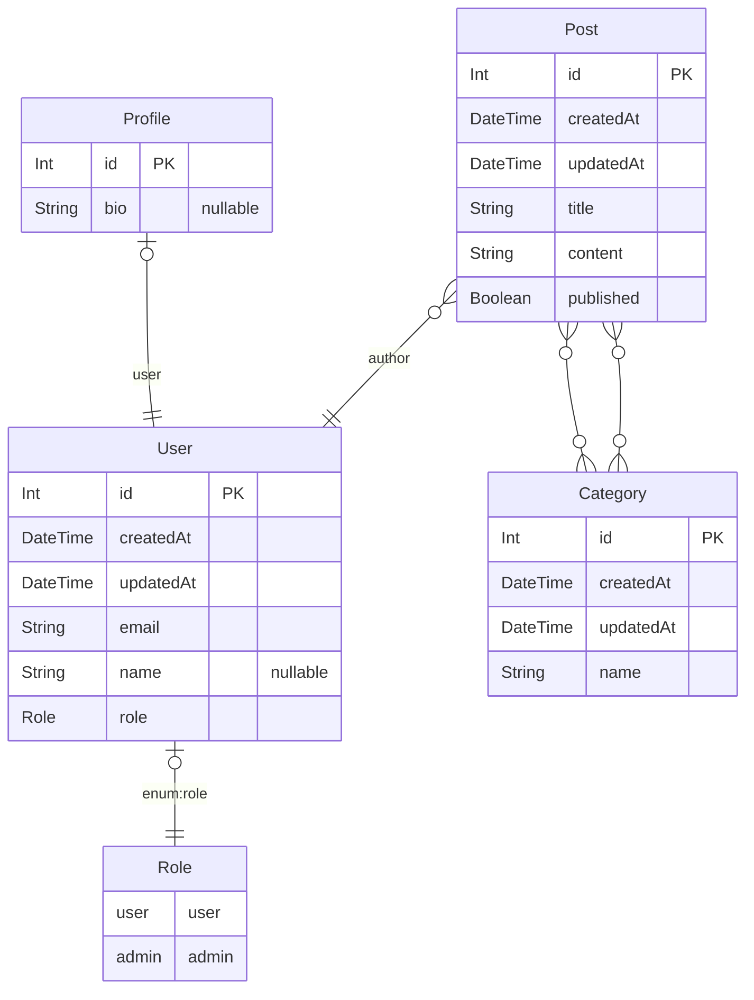

```mermaid
erDiagram

        Role {
            user user
admin admin
        }
    
  User {
    Int id PK 
    DateTime createdAt  
    DateTime updatedAt  
    String email  
    String name  "nullable"
    Role role  
    }
  

  Profile {
    Int id PK 
    String bio  "nullable"
    }
  

  Post {
    Int id PK 
    DateTime createdAt  
    DateTime updatedAt  
    String title  
    String content  
    Boolean published  
    }
  

  Category {
    Int id PK 
    DateTime createdAt  
    DateTime updatedAt  
    String name  
    }
  
    User o|--|| Role : "enum:role"
    Profile o|--|| User : "user"
    Post o{--|| User : "author"
    Post o{--}o Category : ""
    Category o{--}o Post : ""
```
